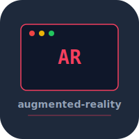

# augmented-reality


ARKit-based augmented reality app built in Swift for iOS 17+ using RealityKit; requires Xcode 26+ and a physical device with LiDAR (simulator has limited AR).

## Features
- Plane detection
- Object placement
- Gesture interaction
- 3D rendering with RealityKit

## Run
```bash
xcodegen generate
open augmented-reality.xcodeproj
```

## Roadmap
- [ ] Scene persistence across app launches
- [ ] Multi-user shared AR sessions
- [ ] In-app asset library browser

## Changelog
- v0.1.0: Initial ARKit app with plane detection, object placement, gesture interaction, and RealityKit rendering.

## License
MIT 2026 Joshua Trommel
